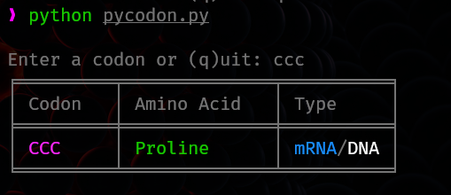

# pycodon



A simple DNA/mRNA codon table written in Python to help you do your biology homework.

# Use
```
python pycodon.py
```
Type in codon and receive respective amino acid profile and type.

# Dependencies
- python = "^3.11"
- colorama = "^0.4.6"
- tabulate = "^0.9.0"
